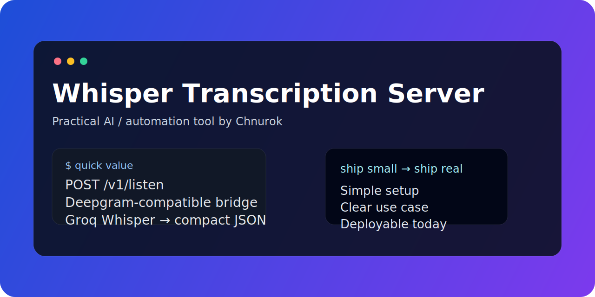

# Whisper Transcription Server



A tiny self-hosted HTTP server that accepts audio and returns a **Deepgram-compatible** transcription response backed by the **Groq Whisper API**.

## Why use it

If an existing tool already speaks the Deepgram API shape, this project lets you keep that integration and swap in Groq Whisper behind a tiny local bridge.

## Highlights

- 🎤 accepts uploaded audio and returns plain-text transcription
- 🔌 compatible endpoint: `POST /v1/listen`
- 🚀 uses `whisper-large-v3-turbo` by default
- 🌍 returns detected language metadata
- 🪶 tiny deployment footprint
- 🏠 binds to `127.0.0.1` by default for local/private use

## Quick start

```bash
git clone https://github.com/Chnurok/whisper-transcription-server.git
cd whisper-transcription-server
python3 -m venv .venv
source .venv/bin/activate
pip install -r requirements.txt
export GROQ_API_KEY=your_groq_api_key
python3 whisper-server.py
```

Server address:

```text
http://127.0.0.1:9876
```

## Configuration

```bash
GROQ_API_KEY=your_groq_api_key
GROQ_MODEL=whisper-large-v3-turbo
WHISPER_PORT=9876
```

Get an API key here: <https://console.groq.com/keys>

## Example request

```bash
curl -X POST http://127.0.0.1:9876/v1/listen   -F "audio=@voice.ogg"
```

## Example response

```json
{
  "results": {
    "channels": [
      {
        "alternatives": [
          {
            "transcript": "Привет, как дела?",
            "confidence": 0.99,
            "words": []
          }
        ]
      }
    ]
  },
  "metadata": {
    "model": "whisper-large-v3-turbo",
    "detected_language": "ru"
  }
}
```

## OpenClaw integration

Use a Deepgram-style transcription endpoint in your OpenClaw config:

```json
{
  "transcription": {
    "provider": "deepgram",
    "endpoint": "http://127.0.0.1:9876"
  }
}
```

## Good fit for

- local assistant tooling
- Telegram or voice-note workflows
- automation pipelines that already expect a Deepgram-like response
- quick internal deployments on a VPS or home server

## Limitations

- uses `curl` under the hood instead of a dedicated Python SDK
- best suited to personal tools and internal deployments
- not intended as a hardened public internet service without reverse proxy + auth

## License

MIT
